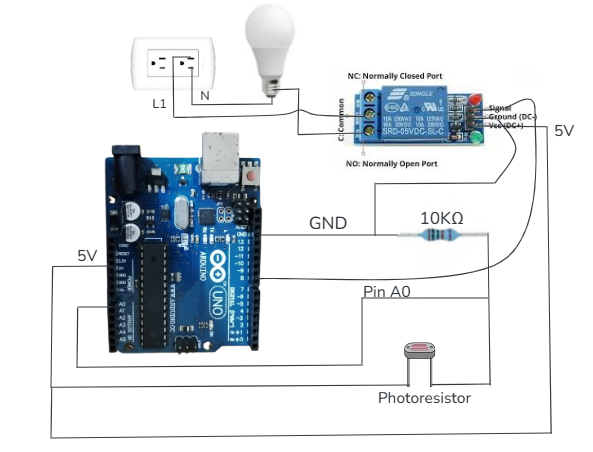

# IoT-TDS
Repositorio de clase para practicas de Internet de las Cosas (IoT). Aqui se agrupan proyectos con firmware, flujos de Node-RED, documentos y recursos de apoyo.

> [!NOTE]
> Material academico para la clase de IoT (TDS).

## Proyectos destacados
| Proyecto | Descripcion | Contenido principal |
|---|---|---|
| `Lámpara-IoT` | Control de lampara con sensor de luz e interfaz web. | `CodeArduino.txt`, `Flows.json`, `control-lampara.html`, `Diagrama.png`, `SensorLuz.pdf` |
| `FireStore-SensorUltrsonico` | Lecturas con sensor ultrasonico y almacenamiento en Firebase. | `CodigoArduino.txt`, `flows.json`, `FireBase-SensorUltrasonico.pdf` |
| `Markdown` | Guia rapida de Markdown para documentacion. | `Guía-Markdown.md`, `Guía-Markdown.pdf` |

## Vista rapida


## Estructura del repositorio
```text
.
├─ FireStore-SensorUltrsonico/
│  ├─ CodigoArduino.txt
│  ├─ flows.json
│  └─ FireBase-SensorUltrasonico.pdf
├─ Lámpara-IoT/
│  ├─ CodeArduino.txt
│  ├─ control-lampara.html
│  ├─ Diagrama.png
│  ├─ Flows.json
│  └─ SensorLuz.pdf
├─ Markdown/
│  ├─ Guía-Markdown.md
│  └─ Guía-Markdown.pdf
└─ README.md
```

## Requisitos sugeridos
- Arduino IDE o compatible para cargar el firmware.
- Node-RED para importar y ejecutar flujos.
- Navegador web moderno para la interfaz HTML.
- Cuenta y proyecto en Firebase si el flujo lo requiere.

## Uso rapido
1. Abre el PDF del proyecto para revisar teoria y pasos.
2. Importa el flujo de Node-RED desde `Flows.json` o `flows.json`.
3. Carga el codigo Arduino del archivo `.txt` en tu placa.
4. Prueba la interfaz web cuando aplique (por ejemplo `control-lampara.html`).

## Recursos
- Diagramas y documentacion dentro de cada carpeta de proyecto.
- Guia de Markdown en `Markdown/` para mejorar la documentacion.

